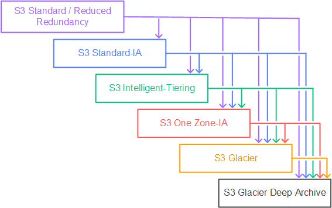

# AWS SAA_Storage

## [S3](https://aws.amazon.com/ko/s3/)

- 출제경향
  - S3 vs EFS vs EBS 
  - S3 수명 주기 관련문제

### 수명 주기

### 사용 프로토콜
- SMB, NFS

### 객체 버전 관리

- Retain Until Date
  - 객체 버전에 보관 기간을 지정함
    - 객체 버전의 메타데이터에 보존기간을 저장함
    - retain until date를 설정을 변경하고 버전 변경을 했을 때 이전버전은 그대로 유지됨

### Encryption for object(객체 암호화)
> 서버측 암호화, 클라이언트측 암호화 2가지로 나누어진다.

#### 1. 서버측 암호화

- SSE-S3
  - AWS에서 관리, S3 데이터키, **AES-256 암호화타입**, 감시, 추적 불가
- SSE-KMS
  - AWS에서 관리, KMS CMK(Customer Master Key), 감시, 추적 가능

#### 2. 클라이언트측 암호화

- SSE-C
  - 클라이언트 제공 암호화키 사용, **HTTPS 사용**, AWS에서 키를 저장하지않음
- Client Side Encryption(클라이언트측 암호화)
  - 클라이언트가 S3로 파일을 보내기전 암호화하고 S3에 보관함

## [EFS](https://aws.amazon.com/ko/efs/)
 > 원자성, 일관성, 격리 및 내구성(ACID)

### 특징

- AWS 클라우드 및 사내 서버의 컴퓨팅 인스턴스에 사용할 공유 file 스토리지
- 네트워크 연결 공유 파일 스토리지 (NFSv4 프로토콜 사용)
- 수천 대의 EC2 인스턴스 간 파일 시스템 공유
- 페타바이트 규모로 탄력적으로 자동 확장 및 축소
- 다중 AZ

## [EBS](https://aws.amazon.com/ko/ebs/)
 
### 특징

- block 레벨 스토리지
- 파일 시스템 생성하고 파일 저장
- 단일 EC2 인스턴스의 전용 블록 스토리지
- 볼륨의 크기를 변경은 수동적인 작업

## [Storage Gateway](https://aws.amazon.com/storagegateway/)

### File Gateway

- SMB, NFS 프로토콜 사용하여 S3에서 객체 저장

### Volume Gateway

- iSCSI를 통한 스토리지 볼륨 제공

### Tape Gateway

- 백업 데이터를 내구성 좋은 방식으로 Glacier나 Glacier Deep Archive에 저장
